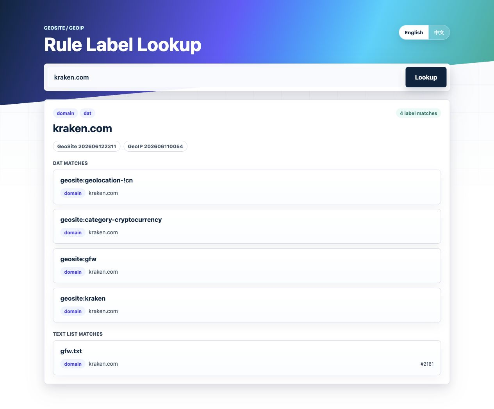

# GeoSite PHP Lookup

Demo site: [https://www.ysui.com](https://www.ysui.com)



GeoSite PHP Lookup is a lightweight PHP web and CLI tool for inspecting GeoSite and GeoIP rule matches. Enter a domain, URL, IP address, or GeoSite label and the app shows which rule sets match it.

It uses V2Ray/Xray-compatible `.dat` databases by default and can also inspect selected text rule lists from the same release.

## Features

- Lookup domains and URLs against `geosite.dat`.
- Lookup IPv4 and IPv6 addresses against `geoip.dat`.
- Lookup a full GeoSite rule set by label, such as `geosite:hetzner`.
- Show matched text-list rules from `apple-cn.txt`, `china-list.txt`, `direct-list.txt`, `direct-tld-list.txt`, `gfw.txt`, and `google-cn.txt`.
- Display local database release versions, publish times, asset URLs, sizes, and SHA-256 digests from `metadata.json`.
- Bilingual web UI with English as the default and Chinese available via `?lang=zh`.
- No Composer dependency required.
- Compatible with PHP 7.0+ and PHP 8.x.

## System Requirements

- PHP 7.0 or newer. PHP 8.x is also supported.
- Required PHP functions/extensions:
  - `json`
  - `filter`
  - `pcre`
  - `inet_pton()` / `inet_ntop()`
- Optional PHP extension:
  - `intl`, used only for IDN domain normalization when available.
- Network access is required only when running `php bin/update-dat.php`.
- A web server that can serve `public/index.php`, such as Nginx, Apache, Caddy, or PHP's built-in development server.

For production deployment, point the web root to:

```text
public/
```

## Quick Start

Run the local web UI:

```bash
php -S 127.0.0.1:8000 -t public
```

Open:

```text
http://127.0.0.1:8000
```

Example URLs:

```text
http://127.0.0.1:8000/?q=kraken.com
http://127.0.0.1:8000/?q=8.8.8.8
http://127.0.0.1:8000/?q=geosite:hetzner
http://127.0.0.1:8000/?q=kraken.com&lang=zh
```

## CLI Usage

```bash
php bin/lookup.php google.com
php bin/lookup.php 8.8.8.8
php bin/lookup.php https://chat.openai.com
php bin/lookup.php geosite:hetzner
```

CLI output is JSON and includes the normalized input, source type, database version metadata, `.dat` matches, and text-list matches when available.

## Supported Query Types

### Domain

Input:

```text
kraken.com
```

The app checks the normalized domain against `geosite.dat`. A domain may match multiple GeoSite labels, for example:

- `geosite:geolocation-!cn`
- `geosite:category-cryptocurrency`
- `geosite:gfw`
- `geosite:kraken`

It also checks downloaded text lists and reports the list file, rule type, rule value, and line number.

### URL

Input:

```text
https://chat.openai.com/
```

The app extracts the host, normalizes it, and performs the same lookup as a domain query.

### IP Address

Input:

```text
8.8.8.8
```

The app checks the IP against `geoip.dat` CIDR ranges. IPv4 and IPv6 are supported.

An IP can match multiple labels, such as provider-specific and country-level labels:

- `geoip:google`
- `geoip:us`

### GeoSite Label

Input:

```text
geosite:hetzner
```

The app returns every rule stored under that GeoSite label. This is useful when you want to inspect all domains covered by a provider, service, or category.

Supported rule types include:

- `domain`
- `full`
- `plain`
- `regex`

### Text Rule Lists

Domain and URL queries also scan these downloaded text lists:

- `apple-cn.txt`
- `china-list.txt`
- `direct-list.txt`
- `direct-tld-list.txt`
- `gfw.txt`
- `google-cn.txt`

Text-list matches are returned separately as `list_matches` so they do not get mixed with GeoSite labels.

## Database Files

Primary `.dat` files:

- `data/source/geoip.dat`
- `data/source/geosite.dat`

Text list files:

- `data/source/lists/apple-cn.txt`
- `data/source/lists/china-list.txt`
- `data/source/lists/direct-list.txt`
- `data/source/lists/direct-tld-list.txt`
- `data/source/lists/gfw.txt`
- `data/source/lists/google-cn.txt`

Release metadata:

- `data/source/metadata.json`

If the `.dat` files are missing, the app falls back to the small sample JSON databases:

- `data/geosite.json`
- `data/geoip.json`

The sample JSON files are intended only as a fallback and development reference.

## Updating Databases

Run:

```bash
php bin/update-dat.php
```

The update script fetches the latest GitHub releases, downloads the required assets, and writes `data/source/metadata.json`.

The script downloads:

- `geoip.dat` from `Loyalsoldier/geoip`
- `geosite.dat` from `Loyalsoldier/v2ray-rules-dat`
- selected text rule lists from `Loyalsoldier/v2ray-rules-dat`

Database updates are not automatic during normal page visits. Visiting the web UI only reads local files. To keep data fresh, run `php bin/update-dat.php` manually or schedule it with cron/systemd.

## Rule Matching

- `domain`: matches the exact domain or any subdomain.
- `full`: matches only the exact domain.
- `plain` / `keyword`: matches when the domain contains the value.
- `regex` / `regexp`: matches using a regular expression.
- `tld`: matches the final domain label, used by `direct-tld-list.txt`.
- `cidr`: matches when an IP address falls within a CIDR range.

## Data Sources

- GeoIP enhanced edition: [Loyalsoldier/geoip](https://github.com/Loyalsoldier/geoip/)
- GeoSite and text rule lists: [Loyalsoldier/v2ray-rules-dat](https://github.com/Loyalsoldier/v2ray-rules-dat/)

## Tests

```bash
php tests/run.php
```
